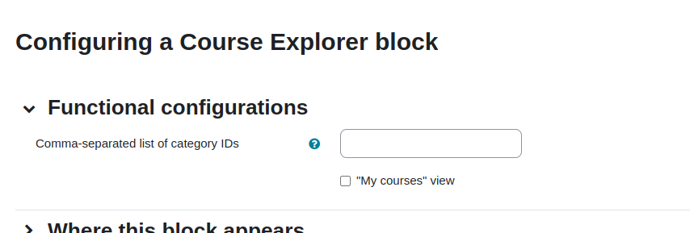
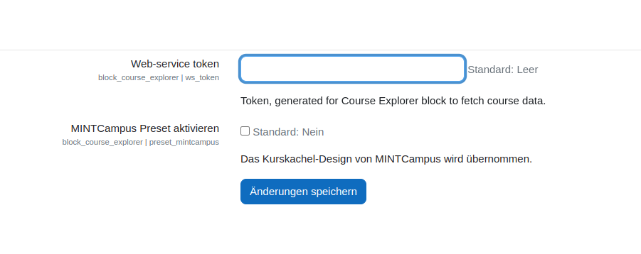

# Course Explorer Block

## Name
block_mat_explorer

## Description
This is a block plugin to display and manage courses in Moodle 4+. Features of this plugin are extended filter and sorting options,
informative course tiles, pre-filtering by course categories and 2 different views: "all courses" and "my courses".
While pre-filtering and views can be set up in a block's configuration (Turn moodle edit mode on ->
click on cog wheel icon of the block -> select configuration), dropdown filters, sorting and information displayed on
tiles are fixed and require code amendments in order to adjust them.

There is an option to apply MINTCampus style preset to a plugin's view. In plugin settings 
(Site administration -> Plugins -> Course Explorer) there is a checkbox allowing to load a MINTCampus CSS-file. 

## Required course fields

The data in filters, sorting and tiles sourced by course custom fields in Site administration -> Courses -> Course custom fields.
Following fields are used at mein.mintcampus.org and required for correct work of the plugin:

#### Name - Identifier - Field type:
- Course duration - mc_moodle_kursdauer - Dropdown menu
- Cost - mc_moodle_kosten - Short text
- Level - mc_moodle_level - Dropdown menu
- License - mc_moodle_copyright - Dropdown menu
- Certificate - mc_moodle_zertifikat - Dropdown menu
- Language - mc_moodle_sprache - Dropdown menu
- Accessibility - mc_moodle_barrierearm - Checkbox
- Topics - mc_moodle_themen - Multiselect menu (installation required)
- MC-Original - mcoriginal - Checkbox
- Format - mc_moodle_format - Dropdown menu
- Target group - mc_moodle_zielgruppe - Multiselect menu (installation required)
- Course provider - mc_moodle_partner_name - Short text

Multiselect menu https://moodle.org/plugins/customfield_multiselect

#### Dropdown filters:
- Course categories - standard moodle course categories
- Topics - mc_moodle_themen
- Target group - mc_moodle_zielgruppe

#### Sort dropdown options:
- Alphabetically asc/desc - sorting by standard moodle course title
- MC-Original - mcoriginal
- Favorites - standard moodle favorite (user preferences)

## Installation
Pack block plugin in the moodle/blocks/ folder as course_explorer and the local service plugin in the moodle/local/ as
course_explorer_service (see [Dependencies on other plugins](#dependencies-on-other-plugins)).

## Dependencies on other plugins

### format_mintcampus
Course tile displays an average rating of a course and number of people, who has rated. At mein.mintcampus.org
this information is aggregated and provided to block_mat_explorer by course format mintcampus.
### local_course_explorer_service
This is a backend of the block plugin aggregating and providing formatted data to the block's frontend.
For correct work a web-service token is required (Site administration -> Server -> Manage tokens).
Created token should be saved in settings of Course Explorer (Site administration -> Plugins -> Scrolling down to Blocks
-> Course Explorer)

## MINTCampus CSS-preset
This preset is located in course_explorer/resources/presets/. File is loaded in the main block php-file (block_mat_explorer).
Generally, one could put own style sheet in the presets folder and adjust path to it in block_mat_explorer in order
to apply it (while the checkbox in settings is checked).

## Screenshots

